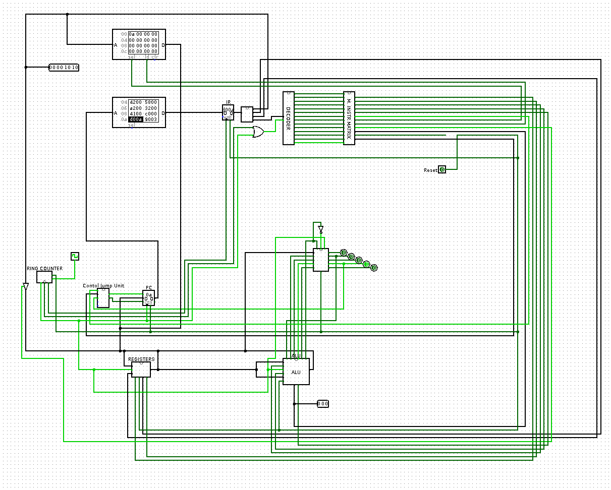

# My first CPU

The purpose of this logisim design was to learn how is working/ design
a simple 8bits CPU.

This CPU execute an instruction in 3 Clock Ticks, driving by a ring counter, wich
switches states each time time main clock tick.

This CPU is based on the Havard model, with the Data Memory and Program
memory are separated. All externs memories are asynchronus which made it
more easy for me, because the result of a read or a write command are
instant in the simulator.

## Rom

The program memory is an asychronous memory which send 2 bytes to the
Instruction Register.
The following will save it during the fetch phase and send it to the
decoder block during the decode phase.

## Ram

The Data memory is an asynchronous memory which send 1 byte into the
main bus of the cpu, which is link to the PC register, registers banks,
and the RAM. That's why a negate door link to the value of the Write Ram
Micro Instruction is here to ensure that the main bus is linked to the
RAM input only when needed.

## ALU

The ALU is here to do all the arithmetic and logic operations. It works
with an Accumulator Register and a specified Register of the Bank register.
That's why you have to put a value inside the accumulator, and then
call an operations between the accumulator and the wanted register.

This increase the number of instruction needed for a simple operations
but made it easier during the design.

## Instruction Set

This CPU has 11 Instructions:
All instruction are on 2bytes and are divided this way:
```
 __________________________________________
| OPCODE | Reg Dst | Reg Src | Immed Value |
 ------------------------------------------
15      12         10        8             0
```
The first 4bits are for the intruction type (mov, load, store, ...).
The next 2bits for Reg Dst and the following 2bits for Reg Src.
The second byte can be interpreted as a Immediate value if needed.

### MOV

Mov Dst, Src

Mov Reg, Reg -> 1 \
Mov Reg, Imm -> 2 \
Mov Acc1, Reg -> 3 \
Mov Acc2, Reg -> 4

### ALU

Add Reg -> 5 \
Xor Reg -> 6 \
And Reg -> 7 \
Or Reg -> 8 \
Cmp -> 12 (C) : signed compare

### Jump

Jump ADDR -> 9

### Memory

Load Reg, ADDR -> 10 (A) \
Store ADDR, Reg -> 11 (B)

## Controls Signals

CS1 => Write on Reg \
CS2 => Read on Reg \
CS3 => Write on Acc1 \
CS4 => Write on Acc2 \
CS5 => Read Ouput ALU \
CS6 => Ecriture PC \
CS7 => Enable Ram Access \
CS8 => Read Ram (1) / Write Ram (0) \
CS9 => Write Immed Value \
CS10 => Select Alu Operations (3bits) \
CS11 => Reset Cpu

## Tests

A reset signal was integrated at the end, because I found that I needed
one in order to facilitate testing. May be I'll find later a way to do
automatize test in Logisim.

To facilitate the tests, I created a very basic assembler python script
which return the opcodes of a given asembly file. It is based on the
under-use scanner part of the regex Python library.

## CPU Design


